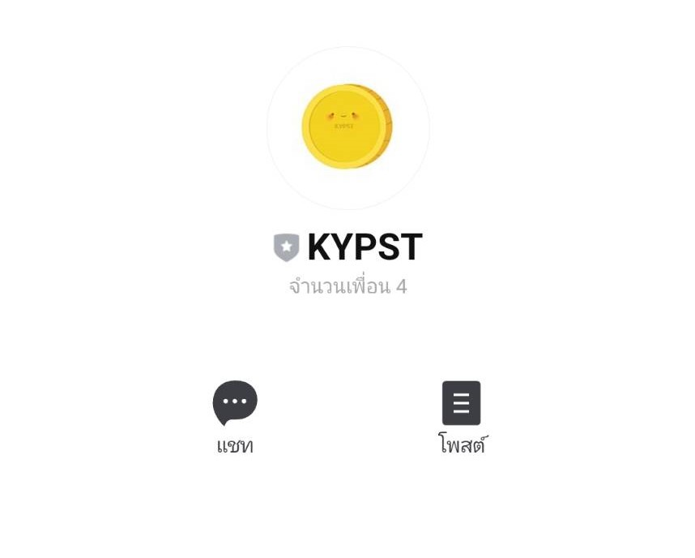
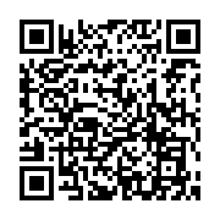
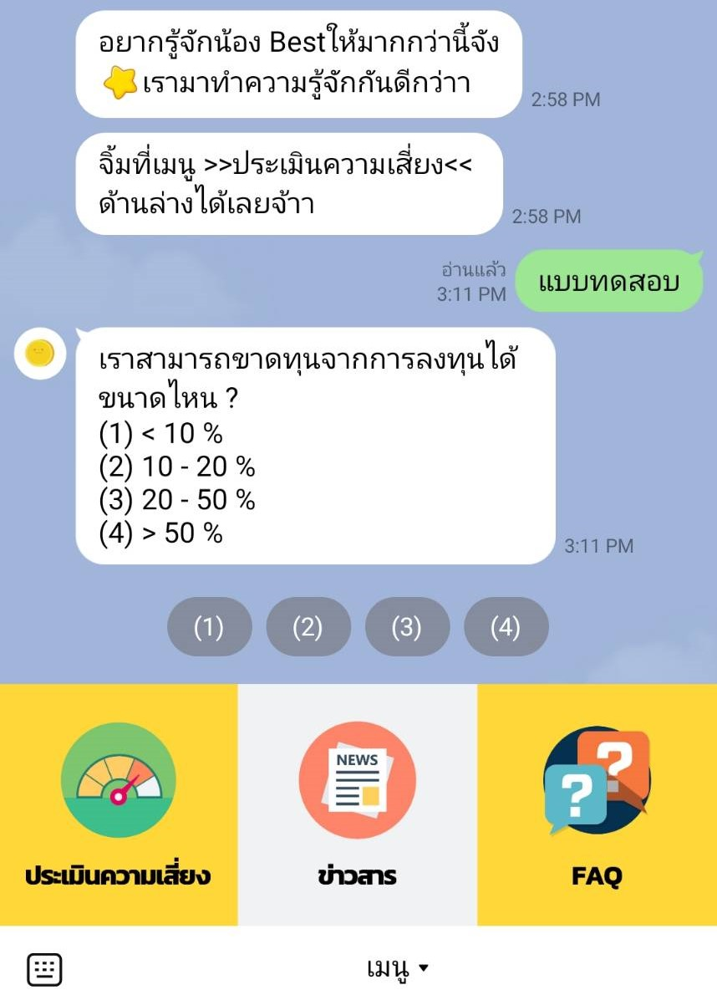
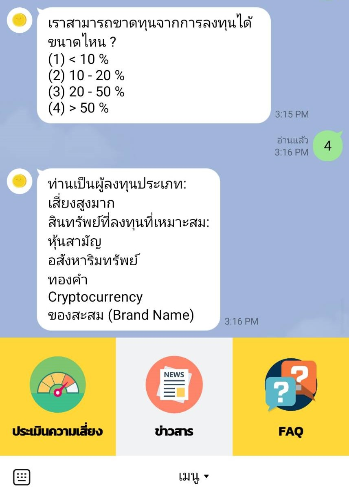
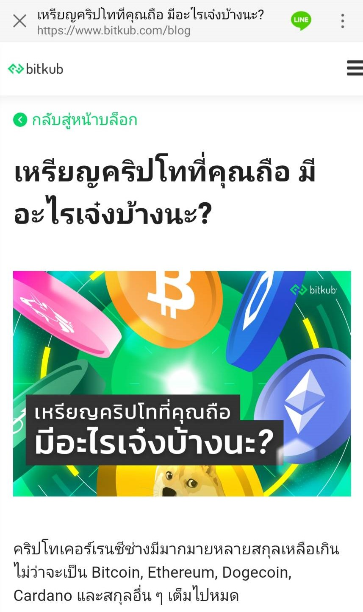
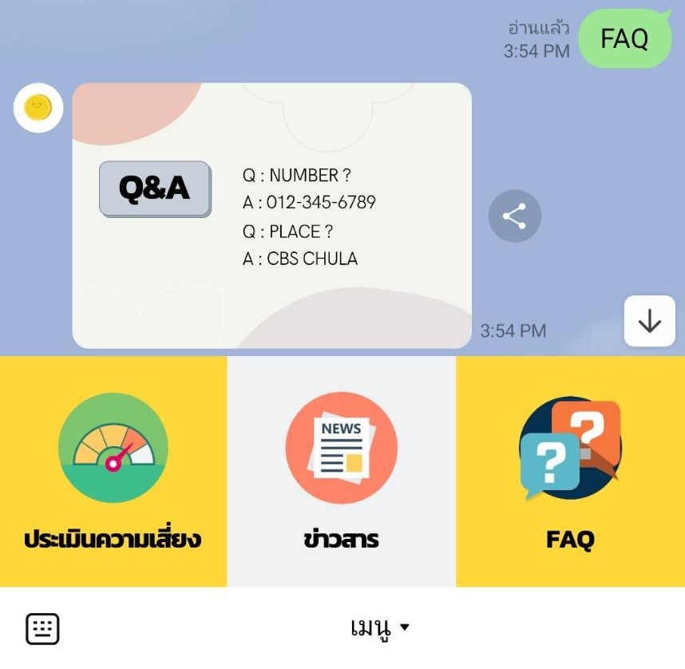

# KYPST Investment Recommendation Chatbot

**KYPST Investment Recommendation Chatbot** เป็น Chatbot ที่พัฒนาขึ้นเพื่อศึกษาการพัฒนา Chatbot บน Line Application ร่วมกับ DialogFlow, Google Cloud Function, SQL และภาษา Python โดยมีวัตถุประสงค์เพื่อให้ผู้ที่เข้ามาใช้ Chatbot สามารถประเมินความเสี่ยงของตนเองได้ว่าตัวเองเหมาะกับการลงทุนประเภทไหน (ทั้งนี้การลงทุนมีความเสี่ยงผู้ลงทุนควรศึกษาข้อมูลก่อนตัดสินใจลงทุน Chatbot นี้เป็นแค่เครื่องมือในการประกอบการตัดสินใจเท่านั้น)

Project นี้เป็นส่วนหนึ่งของวิชา Software Engineering (รหัสวิชา 2603483)

## สมาชิกในกลุ่ม

| รหัสนิสิต | ชื่อ | 
| ------------ | ------------ |
| 6142028326 | นางสาว ณัฐกานต์ เปลี่ยนจันทร์ |
| 6142066126 | นาย ภาสกร ลิ่มชูเชื้อ |
| 6142097626 | นาย หฤษฎ์ หมั้นทรัพย์    |

## ช่องทางสำหรับ add friend

เนื่องด้วยระบบ google cloud platform มีค่าใช้จ่ายในการดำเนินการ ดังนั้นถ้าต้องการทดสอบ chatbot ให้ติดต่อ developer เข้ามาก่อนเพื่อเปิดระบบให้ chatbot สามารถใช้งานได้

## คู่มือในการใช้งาน Chatbot

เมื่อผู้ใช้งาน (User) ทำการ add friend ตัว chatbot แล้ว ตัว Chatbot จะทักทาย User กลับ จากนั้น User จะสามารถเลือกใช้งานฟังก์ชันบนแถบ rich menu ได้ซึ่งมีด้วยกัน 3 ฟังก์ชัน ได้แก่ 

1. แบบทดสอบประเมินความเสี่ยง 
2. รับฟังข่าวสาร 
3. คำถามที่พบบ่อย : FAQ

**คู่มือการใช้งานแบบ Video : [Click Here](https://drive.google.com/file/d/1v51N-gZXBb68N_ez0y56s3dAdCwfWjQt/view)**

---

### 1.) แบบทดสอบประเมินความเสี่ยง

เมื่อ User กดเลือก **เมนูประเมินความเสี่ยง** (rich menu ด้านซ้าย) ตัว Chatbot จะส่งแบบประเมินให้ User ตอบคำถาม โดยมีคำถามทั้งหมด 8 ข้อ เมื่อ User ทำแบบประเมินเสร็จสิ้น ตัวระบบจะรายงาน และบันทึกว่า User เหมาะกับการลงทุนประเภทไหน ดังตัวอย่างในรูป

เมื่อกดเลือกประเมินความเสี่ยง

เมื่อ User ทำแบบประเมินเสร็จสิ้น

---

### 2.) รับฟังข่าวสาร 

เมื่อ User กดเลือก **เมนูข่าวสาร** (rich menu ตรงกลาง) ตัว Chatbot จะส่งข่าวสารโดยแบ่งกรณีเป็น
1. ถ้า User ยังไม่ได้ทำแบบประเมินความเสี่ยง ตัว Chatbot จะส่งข่าวสารทั้งหมดที่ Update ที่สุดให้กับ User 
2. ถ้า User ทำแบบประเมินความเสี่ยงแล้ว ตัว Chatbot จะส่งข่าวสารเฉพาะการลงทุนที่เหมาะกับตัว User ที่ Update ที่สุดให้กับ User แทน แต่ทั้งนี้ User สามารถที่จะเลือกรับข่าวสารทั้งหมดได้เช่นกัน

**!! สำหรับขั้นตอนนี้กำลังอยู่ระหว่างการพัฒนา โดยทางผู้พัฒนาจะใส่เป็น LinkDemo ข่าวสารแทนไว้ก่อน ดังตัวอย่างในรูป**

โดยเมื่อกดเลือกข่าวสารจะ link User ไปยังเว็บไซต์หนึ่ง ๆ แทน

---

### 3.) คำถามที่พบบ่อย : FAQ 

เมื่อ User กดเลือก **เมนู FAQ** (rich menu ด้านขวา) ตัว Chatbot จะมีคำถามที่พบบ่อยให้ User เลือกเบื้องต้น ทั้งนี้ User สามารถพิมพ์คำถามเพื่อถามคำถามกับ chatbot ได้โดยตรงเช่นกัน 

**!! สำหรับขั้นตอนนี้กำลังอยู่ระหว่างการพัฒนา โดยทางผู้พัฒนาจะใส่เป็น response รูปภาพแทนไว้ก่อน ดังตัวอย่างในรูป**

เมื่อกดเลือกข่าวสาร User จะได้รับรูปภาพ FAQ แทน

