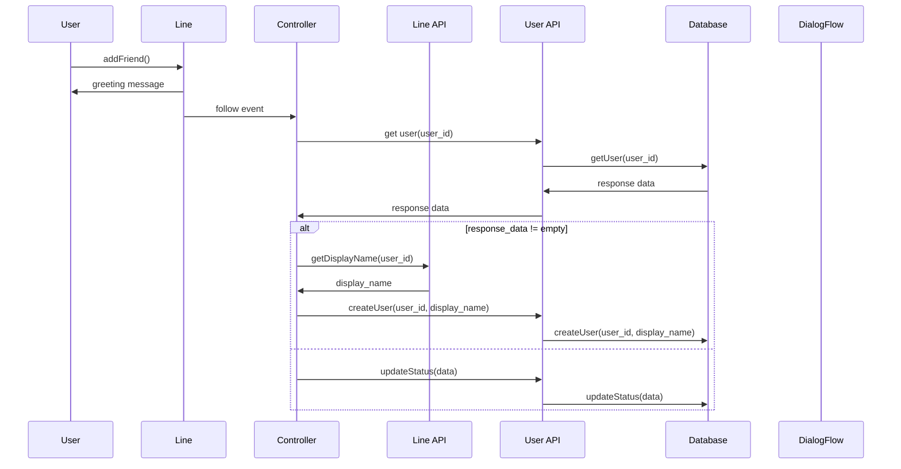
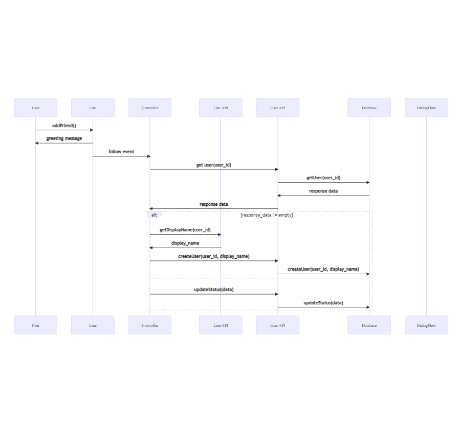
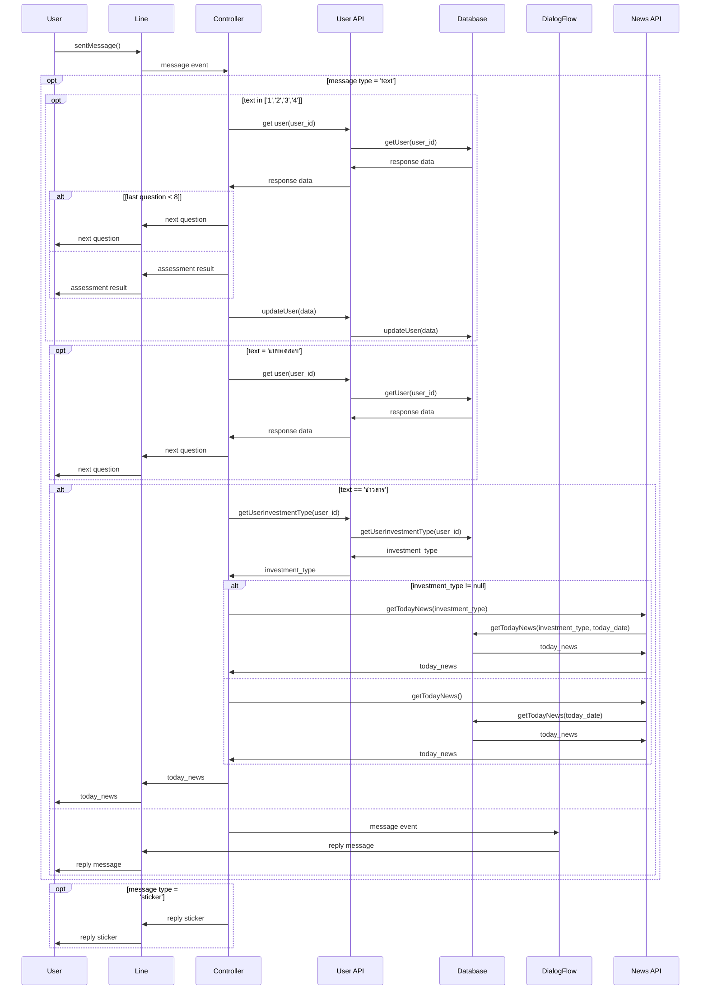
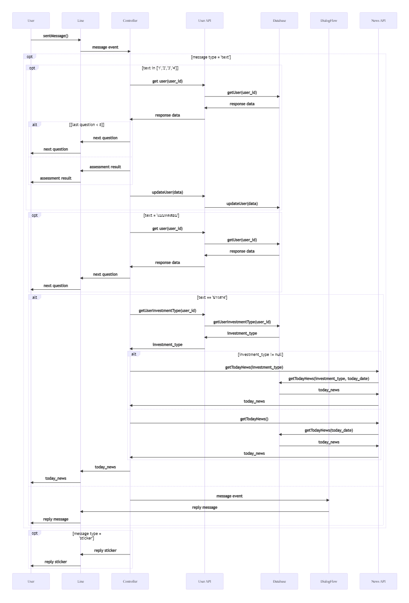
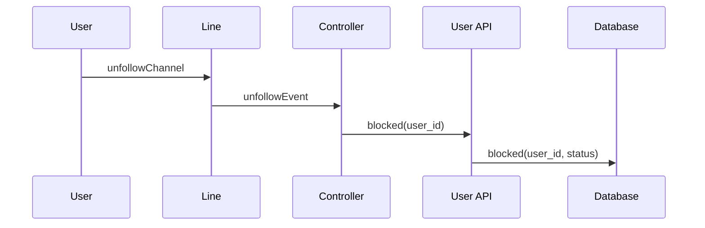
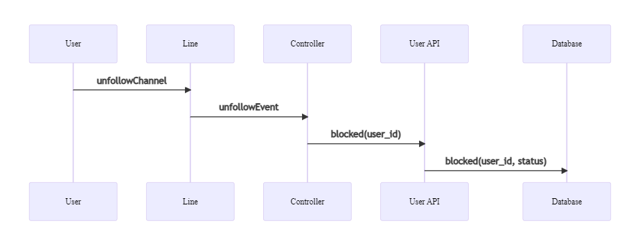

### Sequence Diagram

# Use Case 1 : add-user

```mermaid
    sequenceDiagram
        participant User
        participant Line
        participant Controller
        participant Line API
        participant User API
        participant Database
        participant DialogFlow
        User->>Line: addFriend()
        Line->>User: greeting message
        Line->>Controller: follow event
        Controller->>User API: get user(user_id)
        User API->>Database: getUser(user_id)
        Database->>User API: response data
        User API->>Controller: response data
        alt response_data != empty
            Controller->>Line API: getDisplayName(user_id)
            Line API->>Controller: display_name
            Controller->>User API: createUser(user_id, display_name)
            User API->>Database: createUser(user_id, display_name)
        else 
            Controller->>User API: updateStatus(data)
            User API->>Database: updateStatus(data)
        end
```

# Use Case 2 : send message

```mermaid
    sequenceDiagram
        participant User
        participant Line
        participant Controller
        participant User API
        participant Database
        participant DialogFlow
        User->>Line: sentMessage()
        Line->>Controller: message event
        opt message type = 'text'
            opt text in ['1','2','3','4']
                Controller->>User API: get user(user_id)
                User API->>Database: getUser(user_id)
                Database->>User API: response data
                User API->>Controller: response data
                alt [last question < 8]
                    Controller->>Line: next question
                    Line->>User: next question
                else
                    Controller->>Line: assessment result
                    Line->>User: assessment result
                end
                Controller->>User API: updateUser(data)
                User API->>Database: updateUser(data)
            end
            opt text = 'แบบทดสอบ'
                Controller->>User API: get user(user_id)
                User API->>Database: getUser(user_id)
                Database->>User API: response data
                User API->>Controller: response data
                Controller->>Line: next question
                Line->>User: next question
            end
            alt text == 'ข่าวสาร'
                Controller->>User API: getUserInvestmentType(user_id)
                User API->>Database: getUserInvestmentType(user_id)
                Database->>User API: investment_type
                User API->>Controller: investment_type
                alt investment_type != null
                    Controller->>News API: getTodayNews(investment_type)
                    News API->>Database: getTodayNews(investment_type, today_date)
                    Database->>News API: today_news
                    News API->>Controller: today_news
                else
                    Controller->>News API: getTodayNews()
                    News API->>Database: getTodayNews(today_date)
                    Database->>News API: today_news
                    News API->>Controller: today_news
                end
                Controller->>Line: today_news
                Line->>User: today_news
            else
                Controller->>DialogFlow: message event
                DialogFlow->>Line: reply message
                Line->>User: reply message
            end
        end
        opt message type = 'sticker'
             Controller->>Line: reply sticker
            Line->>User: reply sticker
        end
```

# Use Case 3 : block-user

```mermaid
    sequenceDiagram
        participant User
        participant Line
        participant Controller
        participant User API
        participant Database
        User->>Line: unfollowChannel
        Line->>Controller: unfollowEvent
        Controller->>User API: blocked(user_id)
        User API->>Database: blocked(user_id, status)
```

